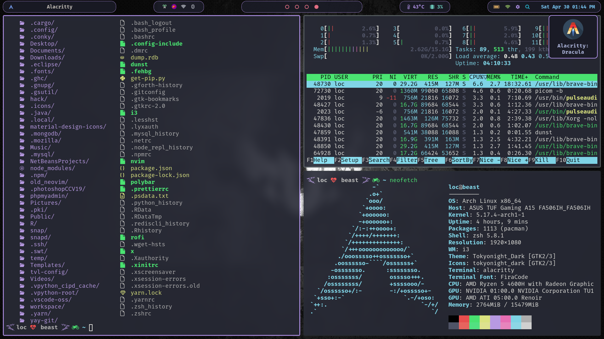

# MY DOTFILE CONFIGURATION

## INSTALLATION

You will need `git` and GNU `stow`
Clone into the `$HOME` directory or `~`

```
git clone https://github.com/loctvl842/tvl-config.git
```

Go to `tvl-config`

```
cd tvl-config
```

Install everything

```
stow *
```

Or just select what you want

```
stow polybar # just my polybar
```

## IMAGES AND USAGE

### ALACRITTY


