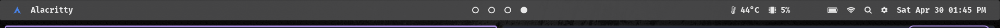
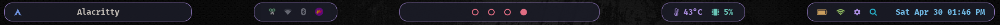
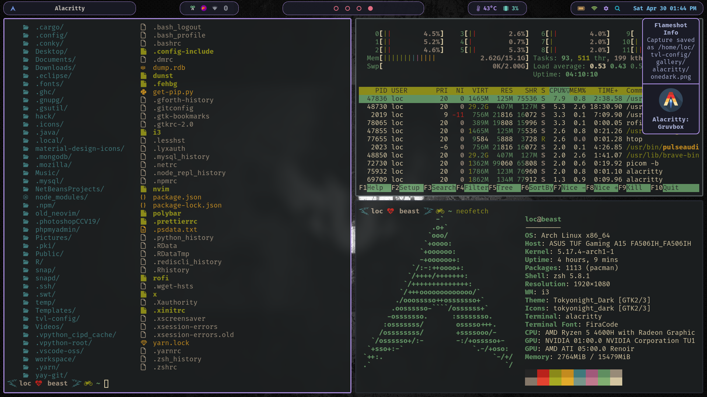
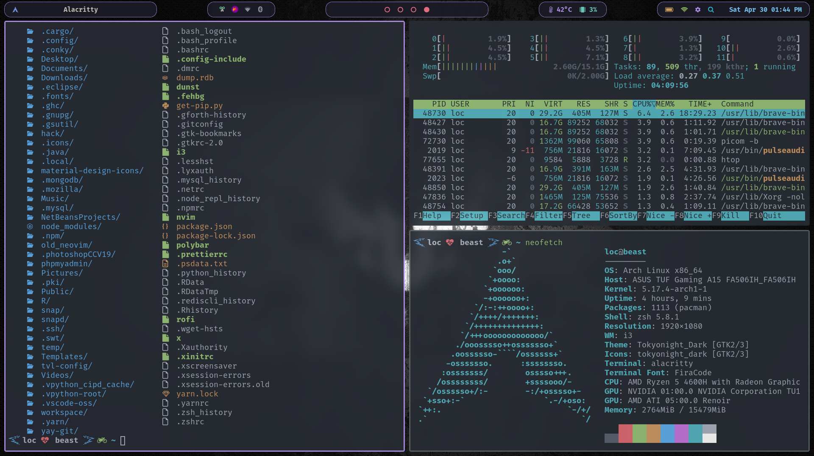
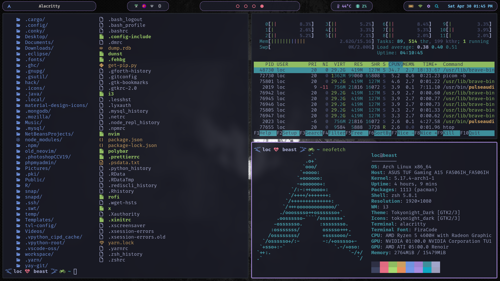
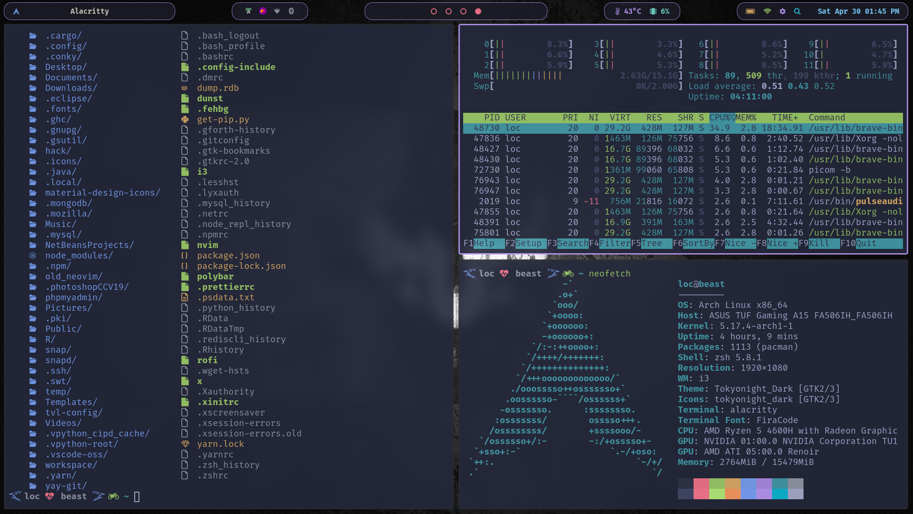
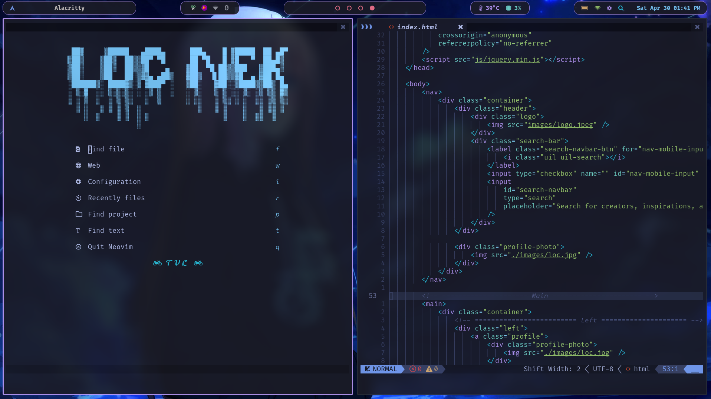
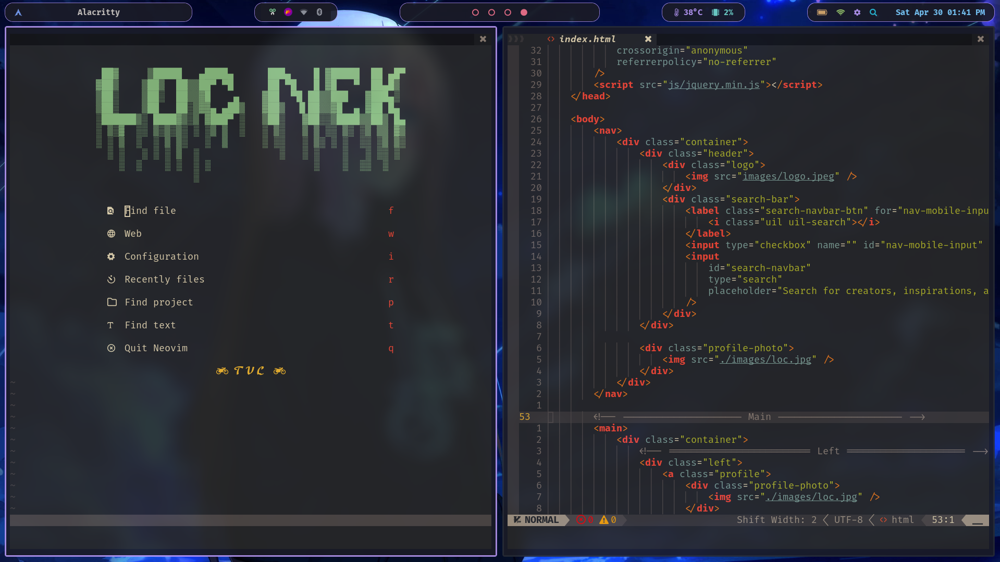
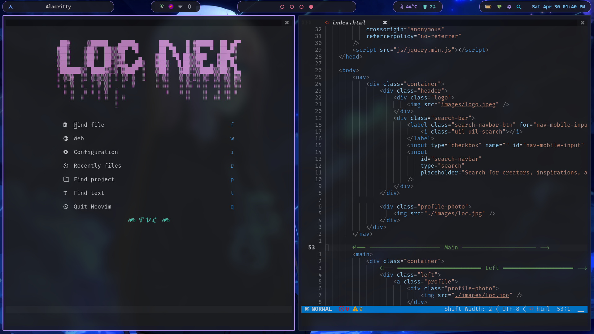
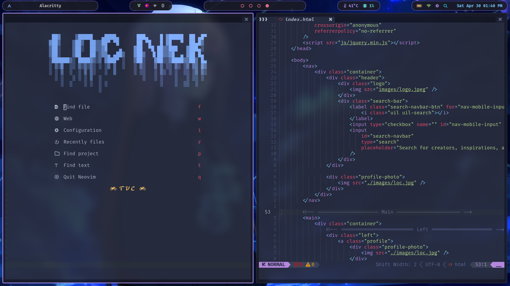

# MY DOTFILE CONFIGURATION

## INSTALLATION

You will need `git` and GNU `stow`
Clone into the `$HOME` directory or `~`

```
git clone https://github.com/loctvl842/tvl-config.git
```

Go to `tvl-config`

```
cd tvl-config
```

Install everything

```
stow *
```

Or just select what you want

```
stow polybar # just my polybar
```

## IMAGES AND USAGE

All the below theme can be changed easily by pressing `WINDOW + s`


In `nvim`, you have to press `SPACE + r` to reset theme if theme doesn't change

### POLYBAR

`White` Color from Macbook


`Colorful`


### ALACRITTY

<p width="49%">Dracula</p> <p width="49%">Gruvbox</p>
 

`Dracula`


`Gruvbox`


`One Dark`


`Tokyo night`


`tokyo-night-storm`


### NEOVIM

`Tokyo night`


`Gruvbox`


`Darkplus`


`Palenight`


## ROFI

There are two positions for `rofi` include `center` and `dropdown` (using for polybar)
Both `center` and `dropdown` folder are devided into 2 main folder which are `src` folder (using for run rofi with special options) and `appearance` folder (using for setting `theme` for each table appear)
