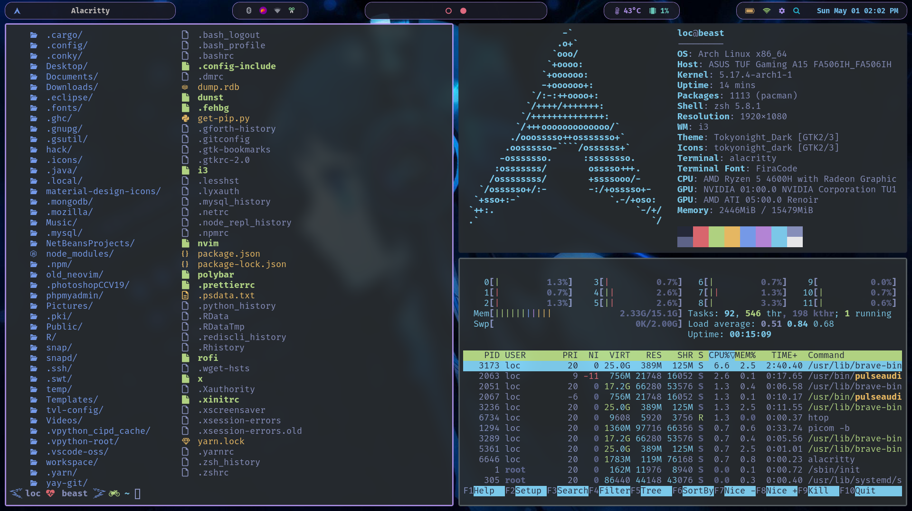

# MY DOTFILE CONFIGURATION

- [INSTALLATION](#INSTALLATION)
- [IMAGES AND USAGE](#images-and-usage)
  - [POLYBAR](#polybar)
  - [ALACRITTY](#alacritty)
  - [NEOVIM](#neovim)

## INSTALLATION

You will need `git` and GNU `stow`
Clone into the `$HOME` directory or `~`

```
git clone https://github.com/loctvl842/tvl-config.git
```

Go to `tvl-config`

```
cd tvl-config
```

Install everything

```
stow *
```

Or just select what you want

```
stow polybar # just my polybar
```

## IMAGES AND USAGE

All the below theme can be changed easily by pressing `WINDOW + s`


In `nvim`, you have to press `SPACE + r` to reset theme if theme doesn't change

### POLYBAR

`White` Color from Macbook


`Colorful`


### ALACRITTY

|                                                 |                                                   |                                                         |
| :---------------------------------------------: | :-----------------------------------------------: | :-----------------------------------------------------: |
|                     Dracula                     |                      Gruvbox                      |                        One Dark                         |
|    |      |            |
|                   Tokyo Night                   |                 Tokyo Night Storm                 |                        Palenight                        |
|  |  |  |

### NEOVIM

|                                                |                                              |
| :--------------------------------------------: | :------------------------------------------: |
|                    Darkplus                    |                  Palenight                   |
|     |  |
|                  Tokyo Night                   |                   Gruvbox                    |
|  |    |

## ROFI

There are two positions for `rofi` include `center` and `dropdown` (using for polybar)
Both `center` and `dropdown` folder are devided into 2 main folder which are `src` folder (using for run rofi with special options) and `appearance` folder (using for setting `theme` for each table appear)
